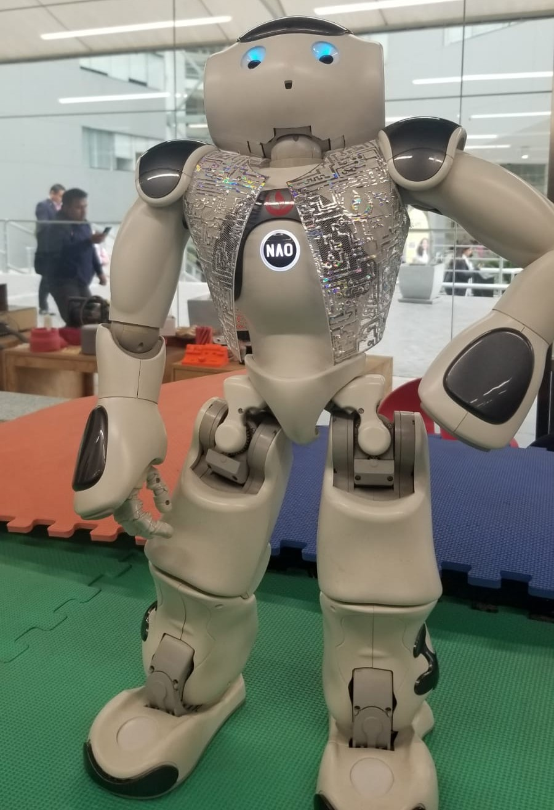

# NAO LLM Integration Project
An implementation of an LLM API to the robot NAO H25 (V6)



## 1. Implemented Objective

We successfully integrated a large language model (LLM) into the NAO robot, enabling it to maintain real-time conversations. The robot can listen to user questions, process them using an advanced AI model (DeepSeek Chat), and respond in a coherent and contextually appropriate manner.

## 2. System Architecture

### Component Diagram
[User]

↓ (speaks)

[NAO - Speech Recognition]

↓ (transcribes text)

[Local FastAPI]

↓ (sends prompt)

[OpenRouter - DeepSeek Chat]

↓ (returns response)

[NAO - Speech Synthesis]

↓ (speaks response)

[User]

### Component Description

1. **NAO Script (Choregraphe)**:
   - Handles speech recognition using ALSpeechRecognition
   - Controls robot behavior (gestures, movements)
   - Communicates with local API via HTTP
   - Manages speech synthesis for responses

2. **FastAPI (LLM Script)**:
   - Local server acting as intermediary
   - Connects to OpenRouter to access DeepSeek model
   - Applies specific conversation guidelines for NAO robot
   - Processes and returns responses optimized for speech synthesis

3. **AI Model (DeepSeek Chat)**:
   - Advanced language model (DeepSeek Chat v3)
   - Configured for brief, conversational responses
   - Optimized for humanoid robot interaction

## 3. Installation Instructions

### Prerequisites
- NAO robot or simulator with Choregraphe installed
- Python 3.7+ for FastAPI server
- OpenRouter account (for LLM API key)
- Stable internet connection

### Implementation Steps:

1. **Set up FastAPI server**:
   ```bash
   # Install dependencies
   pip install fastapi uvicorn httpx python-dotenv
   
   # Create .env file with your API key
   echo "OPENROUTER_API_KEY=your_api_key_here" > .env
   
   # Start server (keep running)
   uvicorn LLM_API:app --host 0.0.0.0 --port 5000

2. **Implement in NAO**:
   - Open Choregraphe and create new behavior
   - Copy content from `Nao_llm_script.py`
   - Adjust URL in `send_to_fastapi()` according to your local network:
     ```python
     url = "http://[YOUR_LOCAL_IP]:5000/chat"  # Example: "http://192.168.1.50:5000/chat"
     ```

3. **Choregraphe Configuration**:
   - Connect robot/simulator
   - Upload behavior to NAO
   - Ensure robot can access the FastAPI server IP

4. **Execution**:
   - Run behavior in Choregraphe
   - Say one of the configured phrases (e.g., "Who are you?")
   - NAO should respond using the AI model

## 4. AI Model Functionality

The implemented model is a DeepSeek Chat-based conversation system with these features:

- **Input**:
  - User speech captured by NAO
- **Processing**:
  - Text cleaning and normalization
  - Sending to language model with specific context
  - Generating optimized conversational responses
- **Output**:
  - Text response converted to speech by NAO
  - Complementary gestural behaviors

## 5. Demonstration Videos

- [Code Explanation](https://drive.google.com/file/d/1D5omx99eGDv26BIoll4jC1NO_zDoR1Yq/view)
- [NAO in Action](https://drive.google.com/file/d/1vZYWfHqmgbIaSqUa7TUgApeQ7ruhRb3o/view)

## 6. Conclusions

This implementation demonstrates how an intelligent agent (the NAO robot) can perform complex actions (natural conversation) as a result of executing an advanced AI model. The system successfully integrates:

- Environment perception (speech recognition)
- Intelligent processing (language model)
- Physical action (speech synthesis and gestures)

## Appendices

- **GitHub**: [https://github.com/leo-dev11/NAO_LLM#](https://github.com/leo-dev11/NAO_LLM#)
- **Code**: [https://drive.google.com/file/d/1D5omx99eGDv26BIoll4jC1NO_zDoR1Yq/view](https://drive.google.com/file/d/1D5omx99eGDv26BIoll4jC1NO_zDoR1Yq/view)
- **NAO**: [https://drive.google.com/file/d/1vZYWfHqmgbIaSqUa7TUgApeQ7ruhRb3o/view](https://drive.google.com/file/d/1vZYWfHqmgbIaSqUa7TUgApeQ7ruhRb3o/view)


